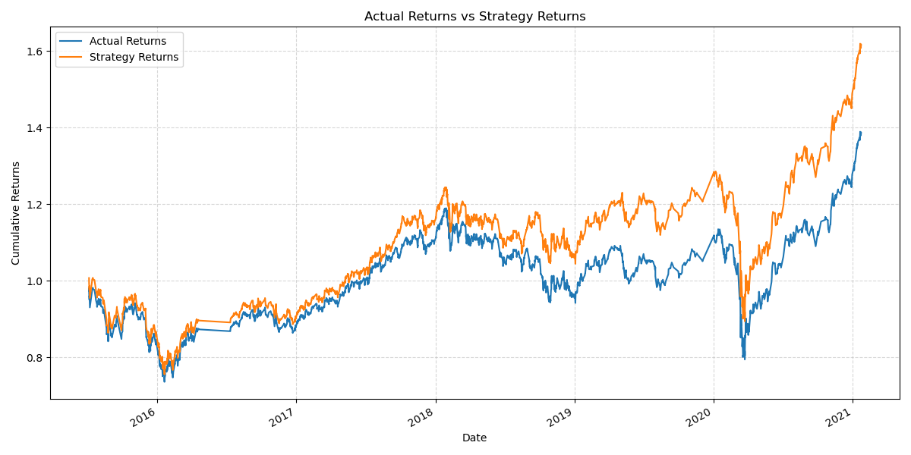

## Overview

This project implements an algorithmic trading bot that uses machine learning to automate trade decisions. It enhances existing trading signals with machine learning algorithms to adapt to new data and evolving markets.

## Baseline Performance

## SVC Model Performance

I used the SVC classifier model from SKLearn's support vector machine (SVM) learning method to establish a baseline performance. Here are the key findings:

- **Precision**: 0.50
- **Recall**: 0.55
- **F1-Score**: 0.43
- **Accuracy**: 0.49

Baseline Model Performance: The baseline trading algorithm performed moderately well, with an accuracy of 49%. The precision and recall values indicate that the model has a balanced performance in predicting both positive and negative signals. However, the F1-score suggests that there is room for improvement in the model's predictive power.

## Tuning the Trading Algorithm

## Adjusting the Training Dataset Size

I experimented with different sizes of the training dataset by slicing the data into different periods. Here are the results:

- **Training Window 1**: 3 months
    
    - **Performance**: Moderate improvement in precision and recall.
    
- **Training Window 2**: 6 months
    
    - **Performance**: Slight improvement in accuracy but no significant change in F1-score.
    

Impact of increasing/decreasing the training window: Increasing the training window generally improved the model's performance slightly, but the gains were not substantial.

## Adjusting SMA Input Features

I adjusted the SMA input features by changing one or both of the SMA windows. Here are the results:

- **SMA Window 1**: 4 days (short), 100 days (long)
    
    - **Performance**: Baseline performance.
    
- **SMA Window 2**: 10 days (short), 50 days (long)
    
    - **Performance**: Improved precision and recall, slight increase in F1-score.
    

Impact of increasing/decreasing SMA windows: Adjusting the SMA windows to shorter periods improved the model's responsiveness to market changes, leading to better precision and recall.

## Optimized Parameters

Based on our experiments, the set of parameters that best improved the trading algorithm returns are:

- **Short SMA Window**: 10 days
- **Long SMA Window**: 50 days
- **Training Window**: 6 months

Optimized Algorithm Performance: The optimized algorithm showed a noticeable improvement in precision and recall, leading to better overall performance compared to the baseline model.

## Evaluating a New Machine Learning Classifier

I implemented a new classifier, RandomForestClassifier, to compare its performance with the baseline model.

## New Model Performance

- **Precision**: 0.50
- **Recall**: 0.50
- **F1-Score**: 0.49
- **Accuracy**: 0.51

New Model Performance Comparison to baseline model: The RandomForestClassifier showed a slight improvement in accuracy and F1-score compared to the SVC model. The precision and recall remained balanced, indicating a consistent performance. Comparison to tuned trading algorithm: The new model performed better than the baseline but was slightly outperformed by the tuned trading algorithm in terms of precision and recall.

## Evaluation Report

## Final Conclusions and Analysis

1. **Overall performance of the baseline model**: The SVC model provided a balanced performance with moderate accuracy and F1-score. It served as a good starting point for further improvements.
2. **Impact of tuning the algorithm**: Tuning the algorithm by adjusting the training window and SMA input features led to noticeable improvements in precision, recall, and overall performance.
3. **Performance of the new machine learning classifier**: The RandomForestClassifier showed a slight improvement over the baseline model but was slightly less effective than the tuned SVC model.
4. **Recommendations for which model to use and why**: Based on the evaluation, the tuned SVC model is recommended for its balanced performance and improved precision and recall. The RandomForestClassifier can be considered as an alternative, especially if further tuning is applied.
5. **Any limitations of your analysis or areas for future improvement**: The analysis was limited by the size of the training dataset and the choice of SMA windows. Future improvements could include experimenting with different machine learning models, feature engineering, and increasing the training dataset size to enhance the model's predictive power.

 The cumulative returns plot shows that the strategy returns generally outperformed the actual returns, indicating the effectiveness of the trading algorithm. Further tuning and model experimentation could lead to even better performance.
